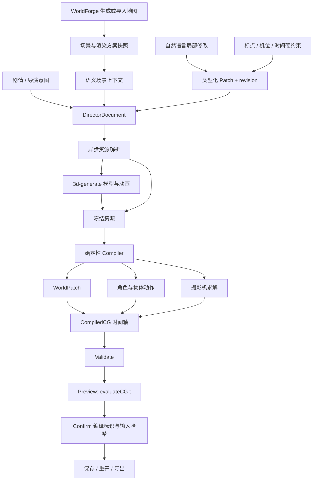

# CGCreator V1 架构

CGCreator 直接扩展 WorldForge，地图仍由 WorldForge 负责生成、导入、编辑与渲染。CG 工作区接收当前可见地图、引用资产和渲染方案的副本，演出编辑不写回源地图。

## 数据所有权

| 数据 | 负责什么 | 修改方式 |
| --- | --- | --- |
| `mapSnapshot` / `schemeSnapshot` | 场景几何、原始物体状态、素材和视觉样式 | 新建 CG 时冻结 |
| `DirectorDocument` | 镜头目的、主体、动作、时间关系、世界需求 | 有版本号的类型化补丁 |
| `constraints` / `anchors` | 用户指定的空间、时间和摄像机要求 | 明确的人工操作；AI 不可改写 |
| `resources` | 模型和已烘焙的原地动画 | 资源解析与缓存；编译后内嵌 |
| `candidate` | 最近一次编译结果、依赖和诊断 | 编译生成；失效草稿不能确认 |
| `confirmed` | 用户确认的可播放版本 | 比较 revision、compileId、inputHash 后替换 |

共同类型定义在 `src/shared/cgTypes.ts`。WorldForge 的旧 `DirectorPlan` 策划草稿保留为历史兼容代码，新工作区使用 `DirectorDocument` 和 `CompiledCG`。

## 最小编译管线

资源阶段可以执行 I/O，纯编译阶段不调用 AI 或远程服务。模型缺失时由资源适配器请求模型；动画要求实际烘焙轨道，并检查模型绑定。离线演示资源明确标为 `builtin`，不能充当生成失败时的隐式替代。

编译器验证引用和能力，应用 WorldPatch 到地图副本，解析镜头和动作的时间关系，求解角色路径，再根据角色状态和导演意图计算机位。动作和镜头是独立轨道，切镜不重置角色。所有用户硬约束参与求解和校验；无法兼容时返回错误，不擅自移动锚点、修改时刻或解锁摄像机。

路径使用 WorldForge 的地形、可玩区域和碰撞几何，地面移动不自动发明跳跃、攀爬或穿墙动作。Camera V1 支持固定、推镜、跟拍、环绕，以及远景、中景、特写和越肩。复杂摇臂、精细自动遮挡规划、自动轴线维护等仍需扩展。

## 确定性与局部修改

`evaluateCG(bundle, t)` 从冻结的初始状态按绝对时间求值。根节点世界位移只有 CG 拥有；模型节点动画只在局部原地播放，避免双重根位移。可见性与受支持的 spark 效果也根据 t 重建，所以倒拖、跳跃和重复预览不会留下历史状态。

CG 模式冻结 WorldForge 内建、依赖增量时间的环境动画；不会宣称它们已经纳入可重放时间轴。确定性指相同输入与时间得到相同场景状态，不承诺跨 GPU 像素完全相同。

自然语言修改输出 `CgPatchOperation[]`，以稳定 ID 指向当前选择。镜头构图修改不会重新生成演员资源；输入哈希和依赖记录标出受影响节点。为了执行完整约束检查，V1 仍允许对整个小型文档重新运行纯编译器；这不同于重新调用 AI 生成整条剧情。

## 持久化与确认

CG 数据存放在 WorldForge 数据目录下的 `cgcreator` 子目录；默认是 `data/map-editor/cgcreator`。项目变更使用进程内串行事务、revision 比较和原子文件替换。该实现面向单个本地 API 进程，不是多服务器共享文件存储方案。

确认 API 只接受当前有效候选版本的编译标识与输入哈希。任何修改、编译失败或陈旧客户端请求都不能覆盖之前确认的版本。导出 JSON 内含场景、资源、文档与时间轴；HDRI 等外部渲染文件仍遵循 WorldForge 的文件解析方式，跨机器分发时需要带上相应环境资源。

## 第一版的明确边界

本版支持地面移动、朝向、原地节点动画、可见性和确定性 spark。验证过的骨骼/socket attach、精确手部接触、IK、口型和通用复杂 VFX 不在本版能力内。所需能力未实现时应给出诊断。场景状态变更使用 WorldForge 已支持的地图事务子集，不加入另一个场景编辑器。

路径避让包含静态世界与静止的绑定道具；多演员与移动道具之间的动态避让尚未实现，需要在预览中检查走位。摄影机遮挡使用有限采样与线段检测，不等同于完整的连续几何证明。

CG 的 AI 与资源服务地址可通过服务端环境变量 `CG_MODEL_API_BASE` 配置；未设置时使用 WorldForge 已有的模型服务地址。自动化测试注入模型与动画响应，验证真实协议和失败处理；本次本地验收没有发起远程 AI 生成请求。

自动校验与人工预览承担不同职责：程序检查结构、引用、时序和可实现的硬约束；导演确认负责构图、叙事和演出质量。第一版不把未经检查的 AI 方案自动标为已确认。

## 验证

运行 `npm test` 和 `npm run build`。关键回归覆盖任意时间采样、碰撞路径、硬约束、局部修改、资源解析、版本冲突与确认事务。浏览器验收应走地图 → CG 导演 → 离线演示 → 编译预览 → 局部修改 / 人工约束 → 确认 → 重开的完整路径。
