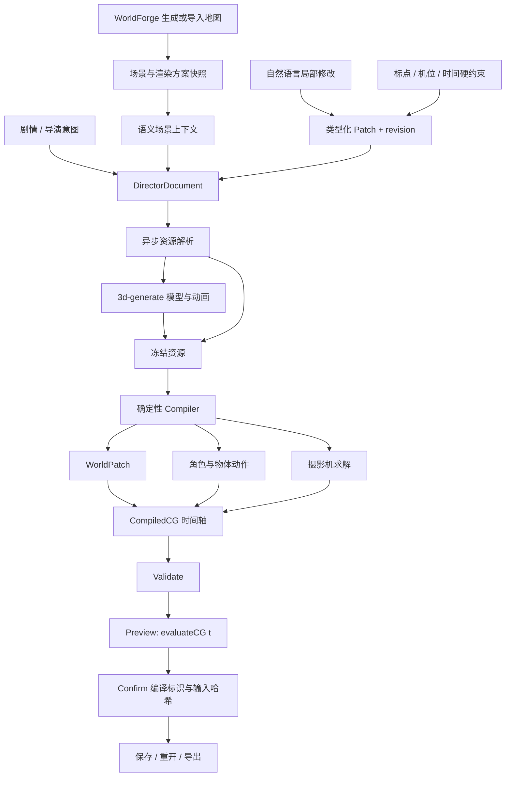

# CGCreator V1 架构

当前一键多 Agent 生成、Run/Artifact、准备门、摄影与表演协商、定向修复和恢复协议见 [CGCreator 多 Agent 生成内核](./cgcreator-multi-agent-runtime.md)。本页继续说明 WorldForge 集成、确定性编译和编辑约束。

V2 基础闭环的当前实现见 [基础演出闭环](./cgcreator-foundation.md)。旧版章节保留为兼容说明；新文档通过行为验证后再进入镜头覆盖阶段。

当前地图精确理解增量见 [导演地图理解](./cgcreator-world-understanding.md)：完整区域关系、可计算边界、来源与缺口、导演只读查询，以及地图同步后重新读取。

CGCreator 直接扩展 WorldForge，地图仍由 WorldForge 负责生成、导入、编辑与渲染。CG 工作区接收当前可见地图、引用资产和渲染方案的副本，演出编辑不写回源地图。

## WorldForge 地图同步

退出 CG、在 WorldForge 修改地图、再进入 CG 时，工作区同时持有两个版本：WorldForge 当前可见地图和 CG 项目上次冻结的 `mapSnapshot`。客户端以地图与渲染方案的规范哈希检测差异；同一地图存在差异时显示“同步当前地图”，不同 `mapId` 的项目禁止同步，避免把演出误接到另一张地图。

`POST /api/cg/projects/:id/sync-map` 接收当前项目 revision、WorldForge 地图和渲染方案。服务端补齐地图引用的模型资源，验证 `mapId`，再通过项目事务原子替换地图与渲染快照。同步保留 `DirectorDocument`、人工硬约束、冻结演出资源和 `confirmed`，清除已经过期的 `candidate`，并记录新增、移除、修改物体以及资源、世界结构和渲染方案差异。客户端随后自动重新编译；如果被删除的物体或变化后的空间使引用、路径或镜头失效，候选版本保留明确诊断，旧 `confirmed` 不被覆盖，新 WorldForge 地图仍可在工作区中检查。

## WorldForge main 基线

基线为 `worldforge-base.json` 中固定的上游 main commit。地图生成、地图 API 与存储、事务、地图工程导出、全局样式和渲染运行库保持上游实现。必要的宿主集成仅为产品标识与端口、`mapEditor` 的新工作区入口与生命周期、服务入口的 CG 路由注册，以及模型边界模块的附加语义焦点计算。`npm run verify:worldforge` 检查其他上游文件没有分叉，并限制新增代码位于 CG 模块边界。

地图编辑器的内部阶段仍为 map/render；CG 工作区动态加载，关闭后恢复地图输入和渲染。地图工程导出不收集 CG 项目；确认演出通过 `/api/cg/projects/:id/export` 单独导出。现有 CG 项目无需格式迁移，地图快照、资源、约束与 confirmed 版本保持原样。

## 数据所有权

| 数据 | 负责什么 | 修改方式 |
| --- | --- | --- |
| `mapSnapshot` / `schemeSnapshot` | 场景几何、原始物体状态、素材和视觉样式 | 新建 CG 时冻结 |
| `DirectorDocument` | 镜头目的、主体、动作、时间关系、世界需求 | 有版本号的类型化补丁 |
| `constraints` / `anchors` | 用户指定的空间、时间和摄像机要求 | 明确的人工操作；AI 不可改写 |
| `resources` | 模型和已烘焙的原地动画 | 资源解析与缓存；编译后内嵌 |
| `candidate` | 最近一次编译结果、依赖和诊断 | 编译生成；失效草稿不能确认 |
| `confirmed` | 用户确认的可播放版本 | 比较 revision、compileId、inputHash 后替换 |

## 空间语义与镜头观察

编译器为每个冻结地图生成 `WorldSemanticIndex`。它把 WorldForge 的设计分组、焦点、候选视点、视觉区域、道路引导线、水体、草地和场景物体，与每个 3d-generate 模型中的节点 ID、名称、父子关系、标签和 semantic snapshot 统一到稳定 ID 空间。每条记录保留来源与置信类别，导演 AI 不需要从 XYZ 猜测“哪里是亭子、树林、池塘或角色头部”。旧项目没有持久化索引时，客户端可从冻结地图确定性重建。

`CgViewObservation` 在指定绝对时间和宽高比下投影场景物体边界，给出画面左/中/右、屏幕矩形、覆盖率、采样可见比例与可能遮挡者。规划后的局部镜头精修会收到所选镜头起点、中点和终点的观察结果。它是机械证据，不承担审美判断，也不宣称完成逐三角形可见性证明。

## 可编辑走位与摄影机路径

编译得到的角色路径和摄影机轨迹作为 3D overlay 显示。自动路径仍属于编译产物，不写回高层导演文档。路线工具采用两级选择：单击选择整条线，双击进入该线的控制点编辑；编辑中再次双击曲线会插入新的途经点。自动摄影机运动默认暴露起点、塑形途经点和终点三个带编号控制点，拖动结束才提交一次文档事务。角色中间点成为有顺序的 `action-route` 硬约束，终点成为 `action-target`；摄影机控制点集合成为有顺序的 `camera-path`。稳定 anchor ID 在插点和重新编译后继续标识同一个人工点，AI 不能移动或删除。

三个及以上的人工摄影机控制点使用开放的 centripetal Catmull-Rom 曲线，并按曲线弧长而非控制点编号求值，因此摄影机经过每个点且在中间点保持连续运动方向。位置路径与镜头注视、语义 aim、画面构图和镜头参数分离：曲线只决定摄影机所在位置，导演意图继续决定它看向哪里。两点路径及旧的 confirmed 编译结果保持线性兼容。带人工途经点的角色路径也使用平滑求值，但每次编译都会把曲线重新投影到地形并采样检查可玩区域与静态碰撞；无法平滑通过时明确报错，不绕开人工点。

共同类型定义在 `src/shared/cgTypes.ts`。CGCreator 唯一演出流程使用 `DirectorDocument` 和 `CompiledCG`；工作区通过 `/api/cg/projects` 保存与编译项目。WorldForge 地图编辑器继续只有地图和渲染两种内部阶段，独立的「CG 导演」入口动态打开演出工作区。

## 最小编译管线

资源阶段可以执行 I/O，纯编译阶段不调用 AI 或远程服务。模型缺失时由资源适配器请求模型；动画要求实际烘焙轨道，并检查模型绑定。离线演示资源明确标为 `builtin`，不能充当生成失败时的隐式替代。

编译器验证引用和能力，应用 WorldPatch 到地图副本，解析镜头和动作的时间关系，求解角色路径，再根据角色状态和导演意图计算机位。动作和镜头是独立轨道，切镜不重置角色。所有用户硬约束参与求解和校验；无法兼容时返回错误，不擅自移动锚点、修改时刻或解锁摄像机。

路径使用 WorldForge 的地形、可玩区域和碰撞几何，地面移动不自动发明跳跃、攀爬或穿墙动作。Camera V1 支持固定、推镜、跟拍、环绕，以及远景、中景、特写和越肩。复杂摇臂、精细自动遮挡规划、自动轴线维护等仍需扩展。

## 确定性与局部修改

`evaluateCG(bundle, t)` 从冻结的初始状态按绝对时间求值。根节点世界位移只有 CG 拥有；模型节点动画只在局部原地播放，避免双重根位移。可见性与受支持的 spark 效果也根据 t 重建，所以倒拖、跳跃和重复预览不会留下历史状态。

CG 模式冻结 WorldForge 内建、依赖增量时间的环境动画；不会宣称它们已经纳入可重放时间轴。确定性指相同输入与时间得到相同场景状态，不承诺跨 GPU 像素完全相同。

自然语言修改输出 `CgPatchOperation[]`，以稳定 ID 指向当前选择。镜头构图修改不会重新生成演员资源；输入哈希和依赖记录标出受影响节点。为了执行完整约束检查，V1 仍允许对整个小型文档重新运行纯编译器；这不同于重新调用 AI 生成整条剧情。

## 持久化与确认

CG 数据存放在 WorldForge 数据目录下的 `cgcreator` 子目录；默认是 `data/map-editor/cgcreator`。项目变更使用进程内串行事务、revision 比较和原子文件替换。该实现面向单个本地 API 进程，不是多服务器共享文件存储方案。

确认 API 只接受当前有效候选版本的编译标识与输入哈希。任何修改、编译失败或陈旧客户端请求都不能覆盖之前确认的版本。导出 JSON 内含场景、资源、文档与时间轴；HDRI 等外部渲染文件仍遵循 WorldForge 的文件解析方式，跨机器分发时需要带上相应环境资源。

## 第一版的明确边界

本版支持地面移动、朝向、原地节点动画、可见性和确定性 spark。验证过的骨骼/socket attach、精确手部接触、IK、口型和通用复杂 VFX 不在本版能力内。所需能力未实现时应给出诊断。场景状态变更使用 WorldForge 已支持的地图事务子集，不加入另一个场景编辑器。

路径避让包含静态世界与静止的绑定道具；多演员与移动道具之间的动态避让尚未实现，需要在预览中检查走位。摄影机遮挡使用有限采样与线段检测，不等同于完整的连续几何证明。

CG 的 AI 与资源服务地址可通过服务端环境变量 `CG_MODEL_API_BASE` 配置；未设置时使用 WorldForge 已有的模型服务地址。自动化测试注入模型与动画响应，验证真实协议和失败处理；本次本地验收没有发起远程 AI 生成请求。

自动校验与人工预览承担不同职责：程序检查结构、引用、时序和可实现的硬约束；导演确认负责构图、叙事和演出质量。第一版不把未经检查的 AI 方案自动标为已确认。

## 验证

运行 `npm test` 和 `npm run build`。关键回归覆盖任意时间采样、碰撞路径、硬约束、局部修改、资源解析、版本冲突与确认事务。浏览器验收应走地图 → CG 导演 → 离线演示 → 编译预览 → 局部修改 / 人工约束 → 确认 → 重开的完整路径。
