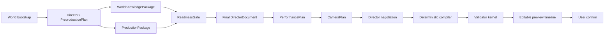

# CGCreator 多 Agent 生成内核

本实现把一次自然语言 CG 生成建模为可恢复的 `CgGenerationRun`。Agent 只产生有类型的计划与证据；项目资源、导演文档和候选演出只通过带 revision 的 `CgService` 事务修改；`compileDirector()` 与 `evaluateCG(bundle, t)` 保持确定性。

## 实际执行顺序



World 与 Production 在第一轮导演文档生成后并行。Camera 读取已经求解的表演；它只能提交 `CgStagingRequest`，不能直接改角色行为。Director 最多进行两轮仲裁。人工位置、路线、机位和时间约束始终保存在 `DirectorDocument.constraints` 中，任何 AI patch 都不能删除或改写它们。

## Agent 与 Artifact

| Agent | 输入 | 输出 | 权限边界 |
| --- | --- | --- | --- |
| Director | 用户意图、地图摘要、准备结果、诊断 | `PreproductionPlan`、`ReadinessGateResult`、正式导演包、`RepairPlan` | 仲裁；不能绕过硬约束和 Validator |
| World | WorldForge 冻结地图与 3d-generate 节点语义 | `WorldKnowledgePackage`、位置证据、未解析引用 | 只读；不从名称猜坐标，不把包围盒说成精确区域 |
| Production | 制作需求、已准备资产、3d-generate 适配器 | 模型、动作、Mount 与 `ProductionPackage` | 使用简短自然语言调用；必须声明真实生成或降级来源 |
| Performance | 正式导演文档、冻结资源、地图几何 | `PerformancePlan` | 求解行为、路线、接触和时间；不设计机位 |
| Camera | 已求解表演、Camera Skill、世界几何 | `CameraPlan`、可选 staging request | 选择镜头与构图；不直接修改表演 |
| Compiler | 已批准的文档与资源 | `CompiledCG` | 无 LLM、无远程 I/O、绝对时间求值 |
| Validator | `CompiledCG`、地图碰撞和画面语义 | owner 已标注的诊断 | 机械验证；Director 负责审美判断 |

Artifact 位于 `data/map-editor/cgcreator/artifacts/`，只写一次，包含 SHA-256、producer、run、项目 revision、地图 version、输入引用和 provenance。Run 位于 `data/map-editor/cgcreator/runs/`，每次阶段变更采用 Windows 兼容的原子替换并记录任务状态。项目 schema 保持 V1，因此旧项目无需迁移。

## 准备门与降级

每个制作要求都标记为：

- `required`：缺失或只有降级结果时停止 Run，生成按 owner 分派的 RepairPlan。
- `approximable`：允许显式 fallback，Run 和 UI 保留原因。
- `optional`：不影响可播放主线，但仍记录缺口。

动作来源区分 `generated`、`builtin` 和 `procedural-fallback`。项目自带并校准过的动作是 `builtin`；3d-generate 失败后由模型语义节点生成的动作是 `procedural-fallback`，不能冒充远程生成成功。Mount 同样区分 `3d-generate-mount` 与 `semantic-node-fallback`。

## 时间轴

`CgTimelineComposition` 采用 OpenTimelineIO 的分层思想，但不引入其运行库：Camera、Actor 与 Prop 分 Track；动作和镜头是 Clip；未覆盖时间为 Gap；切换为 Transition；Clip 的时间范围与资源引用分离。该结构服务编辑器与交换，运行时权威仍是 `CompiledCG`。

并发表演不要求镜头同时开始。自动镜头覆盖以“下一个有效叙事节点”作为顺序镜头边界，因此两名演员可同时走动，镜头仍形成确定的串行剪辑。Transition 不改变演出总时长。

## API

兼容端点 `plan`、`compile`、`confirm` 保留。一键生成使用：

```text
POST /api/cg/projects/:id/runs
GET  /api/cg/projects/:id/runs
GET  /api/cg/projects/:id/runs/:runId
GET  /api/cg/projects/:id/runs/:runId/artifacts/:artifactId
POST /api/cg/projects/:id/runs/:runId/resume
POST /api/cg/projects/:id/runs/:runId/cancel
```

`POST runs` 同步等待当前本地 Run 到达 `preview-ready` 或失败，返回 `{ run, project }`。UI 在等待期间读取原有 progress 端点。失败 Run 保留已完成 Artifact、失败 task、诊断 owner 和 RepairPlan；重启后仍可读取或恢复。

项目修改只失效依赖图下游：镜头修改从 Camera 开始，行为修改从 Performance 开始，资源修改从 Production 开始，地图修改从 World 深读开始。上次 `confirmed` 版本不受失败草稿影响。

## 外部项目带来的具体设计

- [FilmAgent](https://arxiv.org/abs/2501.12909) 启发了导演、演员、摄影师的分阶段 JSON 和有限轮审核。本项目增加强类型、revision、证据和确定性编译，不采用自由文件对话。
- [OpenTimelineIO](https://opentimelineio.readthedocs.io/en/latest/tutorials/otio-timeline-structure.html) 提供 Timeline / Track / Clip / Gap / Transition 的组合模型。
- [Unity Cinemachine](https://github.com/Unity-Technologies/com.unity.cinemachine) 的 Brain、Virtual Camera、Shot 和 Blend 分离启发 CameraPlan 与最终摄影机状态分离。
- [BehaviorTree.CPP](https://github.com/BehaviorTree/BehaviorTree.CPP) 的 Sequence、Parallel、Fallback、状态与 blackboard 启发可恢复任务图；它不参与实时角色播放。
- [OpenUSD](https://openusd.org/release/intro.html) 的稳定路径、引用、组合和来源追踪启发 Artifact ID、provenance 与地图/资源版本绑定。

这些项目仅作为架构资料，没有复制其运行时代码。

